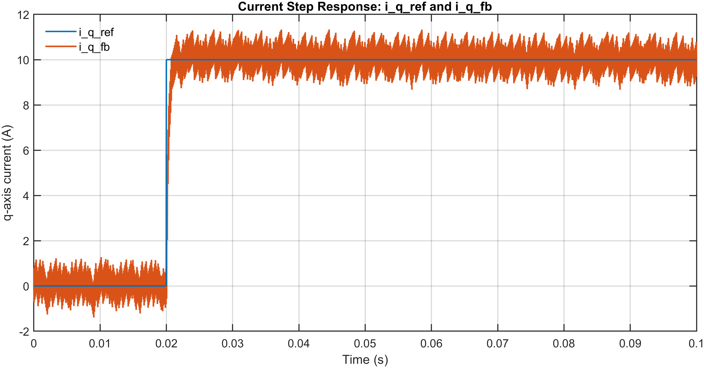
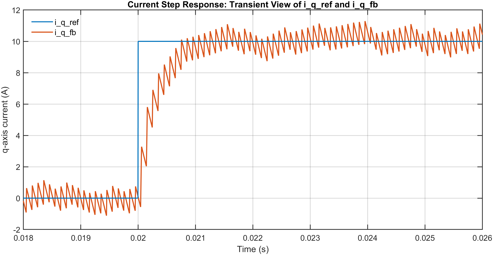
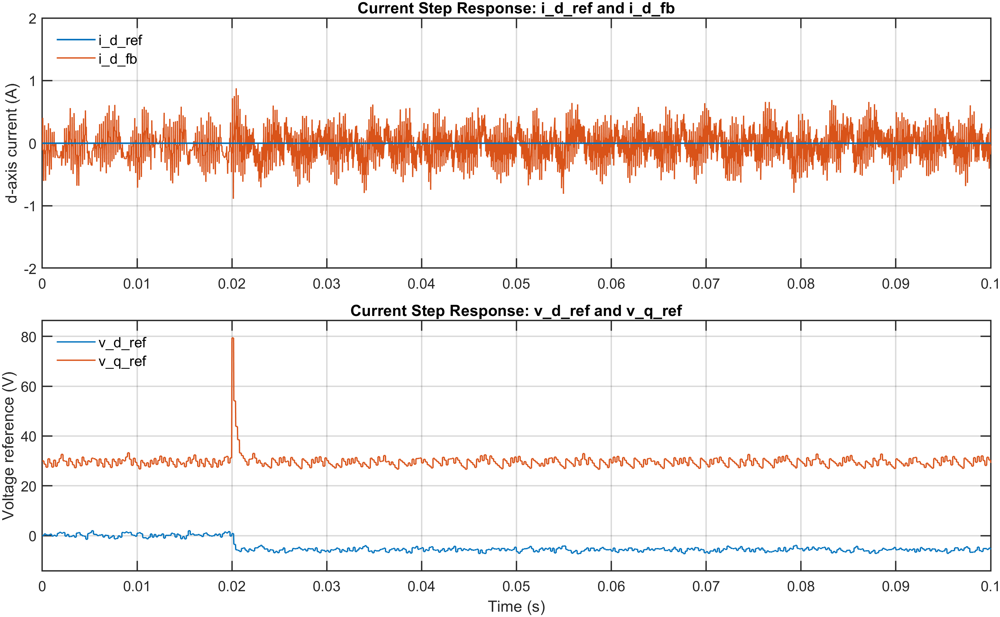
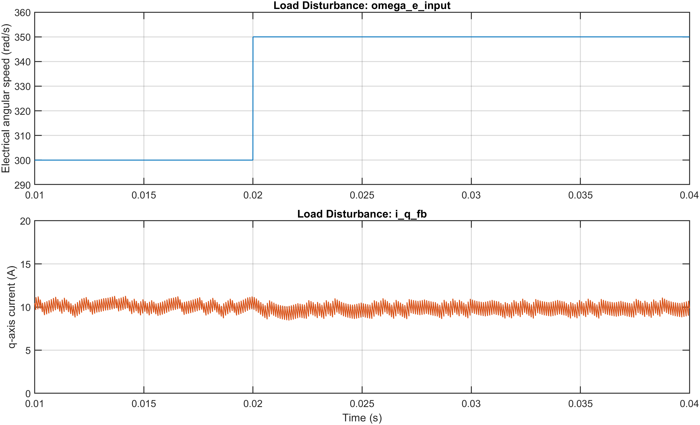
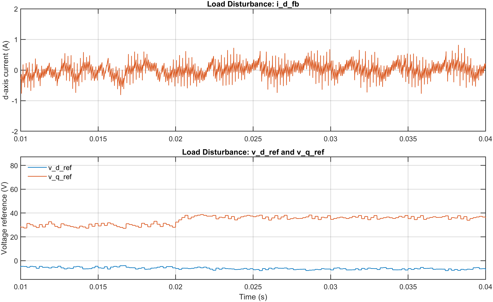
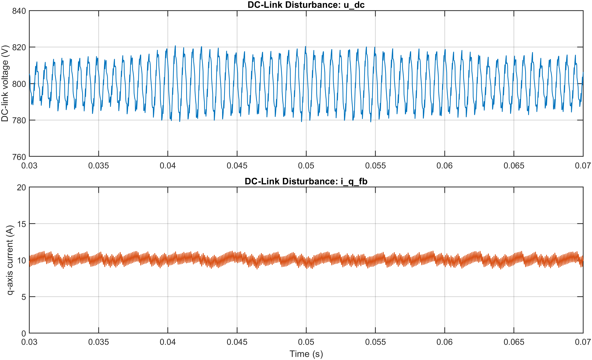
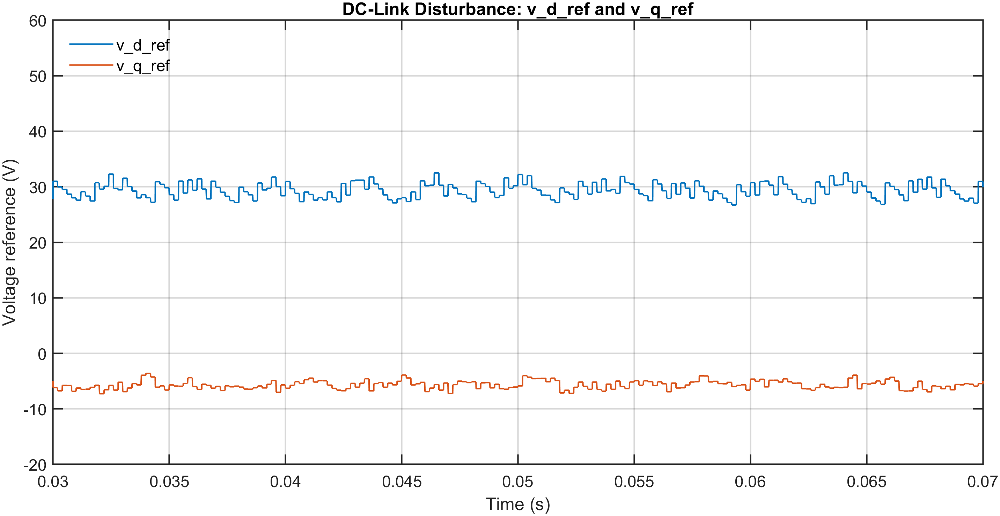

# Control Behaviour

## Scope and Boundary

This document records behaviour-oriented observations on the frozen Phase-4 closed-loop control baseline.

The present material is intended to support interpretable closed-loop behavioural evidence on the frozen Phase-4 closed-loop control baseline, with emphasis on engineering readability, bounded response, and cross-signal interpretability.

The observations recorded here should not be interpreted as tuned-performance validation, implementation-frequency commitment, hardware-facing validation, or robustness-margin conclusion.

---

## Behaviour-Exploration Working Values

At the present stage, selected simulation-facing working settings may be adopted where needed to support readable and interpretable behavioural observation on the frozen Phase-4 closed-loop control baseline.

Such settings should be understood as behaviour-exploration working conditions used for observation on the frozen Phase-4 closed-loop control baseline, rather than final target-machine datasheet confirmation, implementation-level commitments, or tuned-performance outcomes.

The present behavioural cases are observed using the following shared controller working values, adopted here as behaviour-exploration settings rather than tuned-performance outcomes:

- `Kp_id = 5`
- `Ki_id = 100`
- `Kp_iq = 5`
- `Ki_iq = 100`

Where needed, case-specific operating conditions and excitation settings are stated locally within each behaviour section.

---

## Current Step Response

### Case Setup

For the present current-step case, the working setup is based on:

- `i_d_ref = 0 A`
- `i_q_ref` step excitation from `0 A` to `10 A`
- `omega_e_input = 300 rad/s`
- `Ts_ctrl = 1 / 5000 s`
- `f_sw = 5 kHz`

A bounded `i_q_ref` step was applied on the frozen Phase-4 closed-loop control baseline while `i_d_ref` and `omega_e_input` were held unchanged.

The purpose of the present case is to establish a readable current-step behavioural view for the frozen Phase-4 closed-loop control baseline and to assess whether the resulting response remains bounded and interpretable under the present excitation.

### Main View

The main view provides the full-window overview of the present current-step case and is used to assess whether `i_q_fb` follows `i_q_ref` in a readable and bounded manner on the frozen Phase-4 closed-loop control baseline.

Accordingly, the present figure is used primarily to show that:

- overall current-tracking formation is clearly visible over the full observation window
- `i_q_fb` remains bounded following the applied `i_q_ref` step
- readable tracking is interpreted qualitatively through observable response direction, bounded response development, and interpretable approach toward the commanded current level

### Transient View

The transient view complements the main overview by examining the local response formation around the applied `i_q_ref` step.

Accordingly, the present figure is used primarily to show that:

- response onset is more clearly visible around the applied step
- local step-response development toward the commanded current level can be examined in improved detail
- transient-response behaviour remains interpretable on the frozen Phase-4 closed-loop control baseline

### Supporting View

The supporting view complements the main and transient views by observing:

- limited cross-axis interaction through `i_d_fb`
- controller-side command behaviour through `v_d_ref` and `v_q_ref`

The present figure is therefore used to show that:

- cross-axis behaviour remains limited and readable under the applied q-axis step
- `v_d_ref` and `v_q_ref` provide interpretable controller-side command response during current-step establishment
- the current-tracking behaviour seen in the main and transient views is accompanied by readable supporting behaviour on the d-axis and command side within the present Phase-4 closed-loop control baseline context

---

## Load-Side Disturbance

### Case Setup

For the present load-side disturbance case, the working setup is based on:

- `i_d_ref = 0 A`
- `i_q_ref = 10 A`
- `omega_e_input` step perturbation from `300 rad/s` to `350 rad/s`
- `Ts_ctrl = 1 / 5000 s`
- `f_sw = 5 kHz`

In the present case, a bounded perturbation was applied to `omega_e_input` on the frozen Phase-4 closed-loop control baseline while the current-reference operating point was held unchanged.

Within the present Phase-4 interpretation boundary, this case is treated as a load-side disturbance case in the existing electrical-only modelling context, with the applied `omega_e_input` perturbation serving as a load-side surrogate rather than as a full mechanical-load representation.

The purpose of the present case is to observe whether the frozen Phase-4 closed-loop control baseline retains readable and bounded current regulation under the applied perturbation, and whether the associated controller-side reaction remains interpretable within the present modelling boundary.

### Main View

The main view records the applied `omega_e_input` perturbation together with the resulting `i_q_fb` behaviour on the frozen Phase-4 closed-loop control baseline.

In the present case, the applied perturbation introduces only limited visible excursion in `i_q_fb`, while bounded and readable current regulation is retained on the frozen Phase-4 closed-loop control baseline.

Accordingly, the present figure is used primarily to show that:

- a representative perturbation is clearly introduced
- `i_q_fb` remains bounded and readable under the applied perturbation
- the frozen Phase-4 closed-loop control baseline retains interpretable current regulation within the adopted electrical-only Phase-4 boundary

### Supporting View

The supporting view complements the main view by observing:

- limited cross-axis interaction through `i_d_fb`
- controller-side command behaviour through `v_d_ref` and `v_q_ref`

In the present case, the more direct evidence of disturbance handling is observed on the controller side rather than through a large visible excursion in `i_q_fb`.

The supporting view is therefore used to show that:

- `i_d_fb` exhibits only limited and interpretable cross-axis interaction under the applied perturbation
- `v_d_ref` and `v_q_ref` exhibit coherent controller-side reaction following the perturbation
- the retained current regulation seen in the main view is accompanied by readable controller-side adjustment within the present electrical-only modelling boundary

---

## DC-Link Disturbance

### Case Setup

For the present DC-link-disturbance case, the working setup is based on:

- `i_d_ref = 0 A`
- `i_q_ref = 10 A`
- `omega_e_input = 300 rad/s`
- `Ts_ctrl = 1 / 5000 s`
- `f_sw = 5 kHz`

In the present case, bounded DC-link variation was introduced within the existing inverter-side source/DC-link context on the frozen Phase-4 closed-loop control baseline while the current-reference operating point was held unchanged.

For the present behaviour-exploration case, the source/DC-link-side working settings were adjusted as follows:

- Equivalent Source Impedance: from `0.01 ohm` to `0.2 ohm + 1 mH`
- DC-Link Capacitor: from `1 mF` to `10 uF`

Within the present Phase-4 interpretation boundary, these settings are used only as scenario-conditioning values to establish a bounded and readable DC-link-disturbance case.

The purpose of the present case is to observe whether the frozen Phase-4 closed-loop control baseline retains readable and bounded current regulation under bounded DC-link variation, and whether the associated command-side behaviour remains interpretable within the present electrical current-control boundary, rather than to establish a broader DC-source dynamics study, DC-bus design optimisation exercise, or robustness-margin conclusion.

### Main View

The main view records the bounded `u_dc` variation together with the resulting `i_q_fb` behaviour on the frozen Phase-4 closed-loop control baseline.

In the present case, the applied source/DC-link-side conditioning produces clearly visible DC-link variation while `i_q_fb` remains bounded and readable around the established current-reference operating point.

Accordingly, the present figure is used primarily to show that:

- bounded DC-link variation is clearly introduced
- `i_q_fb` remains bounded and readable under the applied source-side variation
- the frozen Phase-4 closed-loop control baseline retains interpretable current regulation within the adopted Phase-4 electrical current-control boundary

### Supporting View

The supporting view complements the main view by observing:

- controller-side command behaviour through `v_d_ref` and `v_q_ref`

In the present case, the more direct supporting evidence for DC-link-disturbance interpretation is observed on the controller side rather than through a large breakdown of current regulation.

The supporting view is therefore used to show that:

- `v_d_ref` and `v_q_ref` remain readable and interpretable under the applied bounded DC-link variation
- controller-side command behaviour remains interpretable within the present electrical current-control context
- the retained current regulation seen in the main view is accompanied by readable controller-side adjustment within the existing Phase-4 modelling boundary