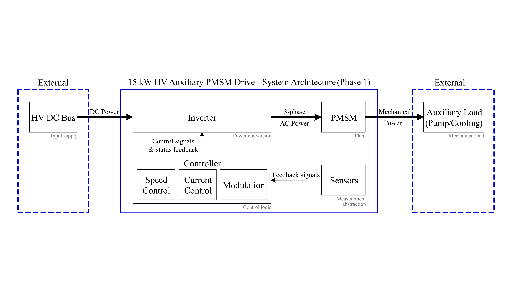

# System Architecture – 15 kW HV Auxiliary PMSM Drive (800 V Platform)

> **Status (Day 10, Phase 1):**  
> Initial system architecture draft. This document defines system boundaries,
> major functional blocks, and high-level power and control interfaces.
> Detailed electrical design, control algorithms, and parameterisation are
> intentionally deferred to later phases.

---

## 1. System Overview and Boundary Definition

The 15 kW high-voltage auxiliary PMSM drive is designed as a self-contained
auxiliary drive system operating on an 800 V DC platform.

From a system-level perspective, a clear boundary is defined between the
auxiliary drive system and its external environment:

- **External systems** include the vehicle high-voltage DC supply and the
  mechanical auxiliary load (e.g. oil pump or coolant pump).
- **Internal system elements** comprise the inverter (power conversion stage),
  PMSM (electric machine), controller (control logic), sensors, and associated
  signal paths.

This explicit boundary definition avoids coupling the auxiliary drive
architecture to higher-level vehicle systems and clarifies responsibility
allocation at the system level.

Figure 1 illustrates the high-level system architecture used throughout
Phase 1, including system boundaries, major functional blocks, and power
and control interfaces.

---

## 2. High-Level System Composition

The auxiliary drive system consists of the following major functional blocks:

- **Inverter**  
  Performs DC–AC power conversion, supplying controlled three-phase AC power
  to the electric machine.

- **Permanent Magnet Synchronous Motor (PMSM)**  
  Acts as the electromechanical plant, converting electrical power into
  mechanical output for the auxiliary load.

- **Controller**  
  Implements supervisory speed control, inner-loop current control, and
  modulation functions required to generate inverter control commands,
  while monitoring inverter status and diagnostic feedback at the system level.

- **Sensors**  
  Provide a measurement abstraction layer for electrical and mechanical
  quantities, supplying feedback signals to the controller without exposing
  signal-level details at the architecture level.

Supporting subsystems such as protection, cooling, and auxiliary power
supplies are considered part of the overall system but are not expanded
in Phase 1.

---

## 3. Power Flow Architecture

The primary energy flow through the system follows a unidirectional path:

1. **DC power input** from the external high-voltage DC bus.
2. **DC–AC conversion** within the inverter stage.
3. **Three-phase AC power delivery** to the PMSM.
4. **Mechanical power output** from the PMSM to the external auxiliary load.

As shown in Figure 1, the power flow is intentionally separated from control
and feedback paths at the architecture level. This separation supports
modular reasoning and facilitates future scalability to different auxiliary
load types or operating conditions.

---

## 4. Control and Feedback Architecture

Control and feedback paths are represented conceptually rather than
algorithmically in Phase 1:

- The **controller** issues control commands to the inverter, including
  modulation- and gating-related signals.
- **Status and diagnostic feedback** from the inverter is returned to the
  controller, forming a bidirectional control interface at the architecture level.
- **Feedback signals** from sensors are routed exclusively to the controller,
  closing the control loop at a functional level.

Specific control strategies, tuning parameters, and protection logic are
intentionally excluded at this stage and will be addressed in later phases.

---

## 5. External Interfaces

The auxiliary drive system interacts with its environment through a limited
set of well-defined interfaces:

- **High-voltage DC interface** connecting the inverter to the external HV supply.
- **Mechanical interface** between the PMSM shaft and the auxiliary load.
- **Internal low-voltage control and sensing interfaces** within the auxiliary drive system.

Communication and diagnostic interfaces are acknowledged but not explicitly
defined in Phase 1.

---

## 6. Relationship to Other Phase 1 Artefacts

This architecture description is consistent with and supported by other
Phase 1 artefacts:

- The **system block diagram**, which provides a simplified functional overview.
- The **system requirements definition**, which constrains ratings and
  operating assumptions.
- The **`system_level.slx` top-level model**, which reflects the same
  high-level structure in a simulation-oriented representation.

Alignment across these artefacts is prioritised over architectural
completeness at this stage.

---

## 7. Open Points and Future Refinement

The following aspects are intentionally deferred to later project phases:

- Detailed electrical topology and component selection.
- Control algorithm implementation and parameter tuning.
- Protection strategies and fault-handling behaviour.
- Thermal, mechanical, and packaging considerations.

This list is indicative rather than exhaustive, and reflects major areas 
intentionally deferred to subsequent phases as the system design matures.

These topics will be progressively addressed as the project evolves
from system-level architecture towards detailed design and implementation.

